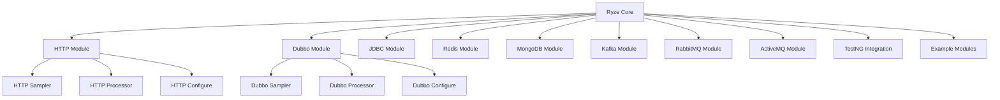

<p align="center">
  
</p>

<h1 align="center">Ryze (瑞兹)</h1>

<p align="center">
  <em>🚀 强大的多协议测试框架，让测试变得简单而优雅</em>
</p>

<p align="center">
  <a href="https://github.com/XiaoMiSum/ryze/blob/master/LICENSE">
    
  </a>
  <a href="https://central.sonatype.com/artifact/io.github.xiaomisum/ryze">
    
  </a>
  <a href="https://github.com/XiaoMiSum">
    
  </a>
  <a href="https://github.com/XiaoMiSum/ryze/releases">
    
  </a>
  <a href="#">
    
  </a>
</p>

---

## 📖 项目简介

<a name="project-introduction"></a>
Ryze 是一个基于 Java 21 开发的现代化测试框架，专为多协议测试而设计。它通过 JSON
描述测试场景，实现了测试用例与代码的完全分离，提供了统一的测试执行方式和丰富的扩展能力。

### ✨ 核心特性

🎯 **测试用例与代码分离** - 采用 JSON/YAML 描述测试场景，保障测试用例的统一性和可维护性

🔧 **多协议支持** - 原生支持 HTTP(S)、Dubbo、JDBC、Redis、MongoDB、Kafka、RabbitMQ 等协议

⚡ **丰富的测试组件** - 内置前置/后置处理器、断言验证器、数据提取器等，轻松实现复杂测试场景

🎨 **灵活的校验机制** - 提供丰富的验证机制和动态参数支持，满足各种测试需求

🚀 **极强的可扩展性** - 基于 SPI 机制，支持自定义协议、处理器、断言规则等组件

📊 **美观的测试报告** - 集成 Allure，生成简洁美观的测试报告

🎪 **函数式编程支持** - 提供 MagicBox 魔法盒子，支持 Groovy 闭包和 Java 函数式接口

🌐 **模板引擎支持** - 基于 FreeMarker 模板引擎，支持动态参数和变量替换

## 📋 目录

- [📖 项目简介](#project-introduction)
- [📋 用户手册](https://xiaomisum.github.io/ryze)
- [🏗️ 系统架构](#system-architecture)
- [🚀 快速开始](#quick-start)
- [💡 使用示例](#usage-examples)
- [📁 文档中心](#documentation-center)
- [🧩 模块说明](#module-description)
- [🛠️ 开发指南](#development-guide)
- [🤝 贡献指南](#contribution-guide)
- [📄 许可证](#license)
- [🙏 鸣谢](#acknowledgements)

## 🏗️ 系统架构

<a name="system-architecture"></a>
Ryze 采用模块化架构设计，核心模块提供基础能力，协议模块提供扩展能力：



### 核心组件

- **测试元件 (TestElement)**: 所有测试组件的基类，支持配置继承和上下文管理
- **取样器 (Sampler)**: 执行具体的测试操作，如发送 HTTP 请求、调用 Dubbo 服务
- **处理器 (Processor)**: 在测试执行前后处理数据，支持前置和后置处理
- **断言器 (Assertion)**: 验证测试结果是否符合预期
- **提取器 (Extractor)**: 从测试结果中提取数据供后续使用

## 🚀 快速开始

<a name="quick-start"></a>

### 系统要求

- **Java**: 21 或更高版本
- **Maven**: 3.8+ (可选)
- **Gradle**: 7.0+ (可选)

### Maven 引入

在您的 `pom.xml` 中添加以下依赖：

```
<!-- 核心模块 -->
<dependency>
    <groupId>io.github.xiaomisum</groupId>
    <artifactId>ryze</artifactId>
    <version>${version}</version>
</dependency>

        <!-- HTTP 协议支持 (已内置在核心模块) -->

        <!-- Dubbo 协议支持 -->
<dependency>
<groupId>io.github.xiaomisum</groupId>
<artifactId>ryze-dubbo</artifactId>
<version>${version}</version>
</dependency>

        <!-- 其他协议模块根据需要添加 -->
```

### Gradle 引入

在您的 `build.gradle` 中添加：

```gradle
implementation 'io.github.xiaomisum:ryze:${version}'
// 根据需要添加其他协议模块
implementation 'io.github.xiaomisum:ryze-dubbo:${version}'
```

## 💡 使用示例

<a name="usage-examples"></a>

### 1. YAML 方式配置测试

创建测试用例文件 `test-case.yaml`：

```
title: "用户登录测试"
children:
  - testclass: http
    title: "登录接口测试"
    config:
      method: POST
      url: "https://api.example.com/login"
      headers:
        Content-Type: "application/json"
      body:
        username: "testuser"
        password: "password123"
    assertions:
      - testclass: json
        field: "$.code"
        expected: 200
        rule: "=="
      - testclass: json
        field: "$.message"
        expected: "success"
        rule: "contains"
    extractors:
      - testclass: json
        field: "$.data.token"
        refName: "userToken"
```

执行测试：

```
import io.github.xiaomisum.ryze.Ryze;

public class LoginTest {
    public static void main(String[] args) {
        // 通过文件路径执行测试
        var result = Ryze.start("test-case.yaml");
        System.out.println("测试结果: " + result.isSuccess());
    }
}
```

### 2. JSON 方式执行测试

创建测试用例文件 `test-case.json`：

```
{
  "title": "用户登录测试",
  "children": [
    {
      "testclass": "http",
      "title": "登录接口测试",
      "config": {
        "method": "POST",
        "url": "https://api.example.com/login",
        "headers": {
          "Content-Type": "application/json"
        },
        "body": {
          "username": "testuser",
          "password": "password123"
        }
      },
      "assertions": [
        {
          "testclass": "json",
          "field": "$.code",
          "expected": 200,
          "rule": "=="
        },
        {
          "testclass": "json",
          "field": "$.message",
          "expected": "success",
          "rule": "contains"
        }
      ],
      "extractors": [
        {
          "testclass": "json",
          "field": "$.data.token",
          "refName": "userToken"
        }
      ]
    }
  ]
}
```

执行测试：

```
import io.github.xiaomisum.ryze.Ryze;

public class LoginTest {
    public static void main(String[] args) {
        // 通过文件路径执行测试
        var result = Ryze.start("test-case.json");
        System.out.println("测试结果: " + result.isSuccess());
    }
}
```

### 3. MagicBox 函数式编程

```
import static io.github.xiaomisum.ryze.MagicBox.*;

public class FluentTest {
    public static void main(String[] args) {
        // 使用 MagicBox 的函数式 API
        var result = suite("用户API测试", builder -> {
            builder.children(children -> {
                children.http(http -> http
                        .title("登录接口")
                        .config(config -> config
                                .method("POST")
                                .url("https://api.example.com/login")
                                .headers(headers -> headers.put("Content-Type", "application/json"))
                                .body(Map.of(
                                        "username", "testuser",
                                        "password", "password123"
                                ))
                        )
                        .assertions(assertions -> assertions
                                .json("$.code", 200, "==")
                        )
                        .extractors(extractors -> extractors
                                .json("$.data.token", "userToken")
                        )
                );
            });
        });

        System.out.println("测试结果: " + result.isSuccess());
    }
}
```

### 4. Groovy 闭包方式

```
import static io.github.xiaomisum.ryze.MagicBox.*

// 使用 Groovy 闭包语法
def result = suite("用户API测试") {
    children {
        http {
            title "登录接口"
            config {
                method "POST"
                url "https://api.example.com/login"
                headers {
                    put "Content-Type", "application/json"
                }
                body([
                        username: "testuser",
                        password: "password123"
                ])
            }
            assertions {
                json {
                    field "\$.code"
                    expected 200
                    rule "=="
                }
                json {
                    field "\$.message"
                    expected "success"
                    rule "contains"
                }
            }
            extractors {
                json {
                    field "\$.data.token"
                    refName "userToken"
                }
            }
        }
    }
}

println "测试结果: ${result.success}"
```

### 5. 使用提取的变量

```
{
  "title": "用户信息查询",
  "children": [
    {
      "testclass": "http",
      "title": "获取用户信息",
      "config": {
        "method": "GET",
        "url": "https://api.example.com/user/profile",
        "headers": {
          "Authorization": "Bearer ${userToken}"
        }
      },
      "assertions": [
        {
          "testclass": "json",
          "field": "$.data.username",
          "expected": "testuser",
          "rule": "=="
        }
      ]
    }
  ]
}
```

## 📁 文档中心

<a name="documentation-center"></a>
框架提供了完整的文档体系，帮助您更好地使用和扩展 Ryze：

### 🌐 在线文档

我们提供了基于 VitePress 的在线文档站点，您可以通过以下链接访问：

- [在线文档](https://xiaomisum.github.io/ryze)
- [中国大陆](https://ryze-rr7xp0ri.maozi.io)

在线文档包含了框架的所有功能介绍、使用指南和 API 参考，是学习和使用 Ryze 的最佳资源。

## 📋 模板引擎和变量系统

Ryze 框架内置了强大的 FreeMarker 模板引擎，支持动态变量替换和函数调用，让测试配置更加灵活和智能。

### 🔧 模板语法

#### 变量引用

```
variables:
  username: "testuser"
  config:
    host: "api.example.com"
    port: 443

# 在配置中引用变量
config:
  url: "https://${config.host}:${config.port}/api"
  headers:
    Authorization: "Bearer ${userToken}"
  body:
    user: "${username}"
```

#### 函数调用

```
variables:
  # 生成随机数据
  random_id: "${uuid()}"
  timestamp: "${timestamp('yyyy-MM-dd HH:mm:ss')}"
  random_string: "${random_string(10)}"

config:
  body:
    id: "${random_id}"
    created_at: "${timestamp}"
    token: "${random_string}"
```

#### 复杂表达式

```
variables:
  base_url: "https://api.example.com"
  version: "v1"
  endpoint: "users"

config:
  # 字符串拼接
  url: "${base_url}/${version}/${endpoint}"
  # 条件表达式
  timeout: "${(response_time?number > 1000)?then(5000, 3000)}"
```

### 🎯 内置变量

框架提供了一些内置变量，可在模板中直接使用：

| 变量名               | 类型               | 描述        |
|-------------------|------------------|-----------|
| `ctx` / `context` | ContextWrapper   | 当前测试上下文对象 |
| `vars`            | VariablesWrapper | 变量包装器对象   |

```
# 使用内置变量
config:
  headers:
    X-Request-ID: "${ctx.evalAsString('${uuid()}')}"
```

### ⚡ 内置函数

框架提供了丰富的内置函数，详细说明请参考 [变量与函数文档](./docs/help/变量与函数.md)：

```
variables:
  # 时间函数
  current_time: "${timestamp()}"
  future_time: "${time_shift('yyyy-MM-dd', 'P7D')}"

  # 随机数据函数
  uuid_value: "${uuid()}"
  random_num: "${random(1000)}"
  random_text: "${random_string(8)}"

  # 加密函数
  password_hash: "${digest('sha256', 'password', 'salt')}"

  # 模拟数据函数
  fake_name: "${faker('name.fullName')}"
  fake_email: "${faker('internet.emailAddress')}"
```

### 🔗 模板包含

YAML 配置支持模板包含，实现配置复用：

```
title: "完整测试用例"
configelements:
  # 包含HTTP默认配置
  - !include '配置元件/http_defaults.yaml'

preprocessors:
  # 包含前置处理器配置
  - !include '处理器/http_preprocessor.yaml'

children:
  # 包含具体的测试步骤
  - !include '取样器/login_sampler.yaml'
  - !include '取样器/profile_sampler.yaml'
```

### 🎨 高级用法

#### 动态配置生成

```
variables:
  environments:
    dev:
      host: "dev-api.example.com"
      port: 8080
    prod:
      host: "api.example.com"
      port: 443
  env: "dev"  # 当前环境

config:
  # 根据环境动态选择配置
  protocol: "${(environments[env].port == 443)?then('https', 'http')}"
  host: "${environments[env].host}"
  port: "${environments[env].port}"
```

#### 条件处理

```
variables:
  user_type: "admin"

config:
  headers:
    # 根据用户类型设置不同的认证方式
    Authorization: >
      ${(user_type == 'admin')?then(
        'Bearer ' + admin_token,
        'Basic ' + user_token
      )}
```

### 📖 模板最佳实践

1. **变量命名**: 使用有意义的变量名，采用snake_case命名规范
2. **配置分离**: 将环境相关配置与测试逻辑分离
3. **模板复用**: 充分利用`!include`指令复用通用配置
4. **错误处理**: 在模板中添加必要的默认值和错误处理
5. **性能优化**: 避免在循环中进行复杂的模板计算

```
variables:
  # 良好的变量组织
  api_config:
    base_url: "${base_url!'https://api.example.com'}"
    timeout: "${request_timeout!5000}"
    retry_count: "${retry_count!3}"

  # 环境特定配置
  database_config:
    host: "${db_host!'localhost'}"
    port: "${db_port!3306}"
    name: "${db_name!'testdb'}"
```

## 🧩 模块说明

<a name="module-description"></a>

### 核心模块

| 模块            | 功能              | Maven 坐标                                     |
|---------------|-----------------|----------------------------------------------|
| `ryze`        | 核心模块，包含HTTP协议支持 | `io.github.xiaomisum:ryze:${version}`        |
| `ryze-testng` | TestNG 集成支持     | `io.github.xiaomisum:ryze-testng:${version}` |

### 协议模块

| 协议       | 模块名           | 功能描述            | Maven 坐标                                     |
|----------|---------------|-----------------|----------------------------------------------|
| Dubbo    | `ryze-dubbo`  | Dubbo RPC 协议支持  | `io.github.xiaomisum:ryze-dubbo:${version}`  |
| JDBC     | 内置            | 数据库测试支持         | -                                            |
| Redis    | 内置            | Redis 数据库测试     | -                                            |
| MongoDB  | `ryze-mongo`  | MongoDB 数据库测试   | `io.github.xiaomisum:ryze-mongo:${version}`  |
| Kafka    | `ryze-kafka`  | Kafka 消息队列测试    | `io.github.xiaomisum:ryze-kafka:${version}`  |
| RabbitMQ | `ryze-rabbit` | RabbitMQ 消息队列测试 | `io.github.xiaomisum:ryze-rabbit:${version}` |
| ActiveMQ | `ryze-active` | ActiveMQ 消息队列测试 | `io.github.xiaomisum:ryze-active:${version}` |

### 示例模块

每个协议都提供了对应的示例模块，位于 `example/` 目录下：

- `example/http-example` - HTTP 协议使用示例
- `example/dubbo-example` - Dubbo 协议使用示例
- `example/jdbc-example` - JDBC 数据库使用示例
- `example/redis-example` - Redis 使用示例
- ……

## 🛠️ 开发指南

<a name="development-guide"></a>

### 环境要求

- JDK 21+
- Maven 3.8+
- Git
- Node.js 14+ (用于文档站点开发)

### 本地开发

1. **克隆项目**

```
git clone https://github.com/XiaoMiSum/ryze.git
cd ryze
```

2. **编译项目**

```bash
mvn clean install
```

3. **运行测试**

```bash
mvn test
```

4. **文档站点开发**

```bash
# 安装依赖
npm install

# 启动开发服务器
npm run docs:dev

# 构建文档站点
npm run docs:build
```

5. **导入 IDE**

推荐使用 IntelliJ IDEA 或 Eclipse，直接导入 Maven 项目。

### 项目结构

```
ryze/
├── ryze/                     # 核心模块
│   ├── src/main/java/          # 核心源代码
│   └── src/test/java/          # 核心测试代码
├── ryze-dubbo/               # Dubbo 协议模块
├── ryze-kafka/               # Kafka 协议模块
├── ryze-mongo/               # MongoDB 协议模块
├── ryze-rabbit/              # RabbitMQ 协议模块
├── ryze-active/              # ActiveMQ 协议模块
├── ryze-testng/              # TestNG 集成模块
├── example/                  # 示例模块
│   ├── http-example/
│   ├── dubbo-example/
│   └── ……
├── docs/                     # 文档目录
│   ├── .vitepress/             # VitePress 配置
│   ├── guide/                  # 用户指南
│   ├── api/                    # API 文档
│   ├── examples/               # 使用示例
│   └── index.md                # 文档首页
└── README.md                 # 项目说明
```

## 🤝 贡献指南

<a name="contribution-guide"></a>
我们欢迎各种形式的贡献！

### 贡献方式

1. **报告 Bug** - 在 [Issues](https://github.com/XiaoMiSum/ryze/issues) 中提交 Bug 报告
2. **功能建议** - 在 Issues 中提出新功能建议
3. **代码贡献** - Fork 项目后提交 Pull Request
4. **文档完善** - 改进文档和示例

### Pull Request 流程

1. Fork 本仓库
2. 创建新的功能分支 (`git checkout -b feature/amazing-feature`)
3. 提交你的修改 (`git commit -m 'Add some amazing feature'`)
4. 推送到分支 (`git push origin feature/amazing-feature`)
5. 创建 Pull Request

### 开发规范

- 遵循现有的代码风格
- 添加适当的单元测试
- 更新相关文档
- 确保所有测试通过

### 自定义协议开发

参考现有协议模块，实现以下接口：

- `Sampler` - 取样器接口
- `Preprocessor` - 前置处理器接口
- `Postprocessor` - 后置处理器接口
- `ConfigureElement` - 配置元件接口

并在 `META-INF/services/` 目录下注册 SPI 服务。

## 📄 许可证

<a name="license"></a>

```
The MIT License (MIT)

Copyright (c) 2018. Lorem XiaoMiSum (mi_xiao@qq.com)

Permission is hereby granted, free of charge, to any person obtaining
a copy of this software and associated documentation files (the
'Software'), to deal in the Software without restriction, including
without limitation the rights to use, copy, modify, merge, publish,
distribute, sublicense, and/or sell copies of the Software, and to
permit persons to whom the Software is furnished to do so, subject to
the following conditions:

The above copyright notice and this permission notice shall be
included in all copies or substantial portions of the Software.

THE SOFTWARE IS PROVIDED 'AS IS', WITHOUT WARRANTY OF ANY KIND,
EXPRESS OR IMPLIED, INCLUDING BUT NOT LIMITED TO THE WARRANTIES OF
MERCHANTABILITY, FITNESS FOR A PARTICULAR PURPOSE AND NONINFRINGEMENT.
IN NO EVENT SHALL THE AUTHORS OR COPYRIGHT HOLDERS BE LIABLE FOR ANY
CLAIM, DAMAGES OR OTHER LIABILITY, WHETHER IN AN ACTION OF CONTRACT,
TORT OR OTHERWISE, ARISING FROM, OUT OF OR IN CONNECTION WITH THE
SOFTWARE OR THE USE OR OTHER DEALINGS IN THE SOFTWARE.
```

## 🙏 鸣谢

<a name="acknowledgements"></a>
感谢以下开源项目和组织的支持：

- **[JetBrains](https://www.jetbrains.com)** - 提供优秀的 IDE 工具
- **[帽子云](https://www.maoziyun.com/)** - 提供免费的静态页面托管服务
- **[FastJSON2](https://github.com/alibaba/fastjson2)** - JSON 序列化库
- **[FreeMarker](https://freemarker.apache.org)** - 模板引擎
- **[Apache Commons](https://commons.apache.org)** - 工具类库
- **[TestNG](https://testng.org)**  - 测试框架
- **[Allure](https://docs.qameta.io/allure/)** - 测试报告框架

---

<p align="center">
  如果您觉得 Ryze 有用，请给我们一个 ⭐️！
</p>

<p align="center">
  有问题或建议？欢迎在 <a href="https://github.com/XiaoMiSum/ryze/issues">Issues</a> 中交流讨论！
</p>