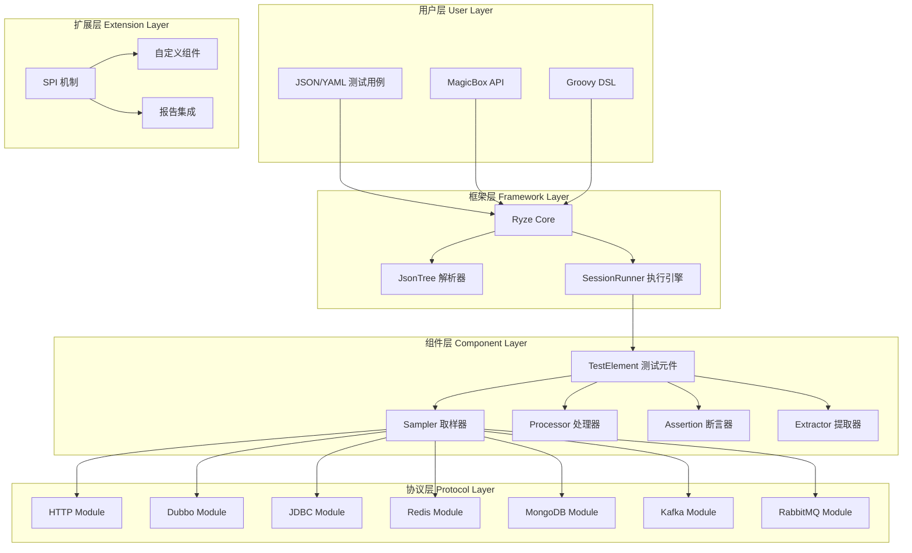
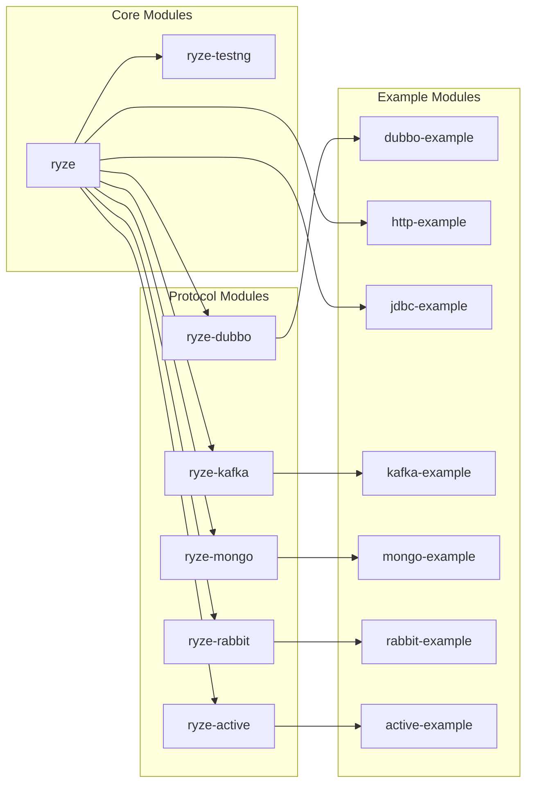
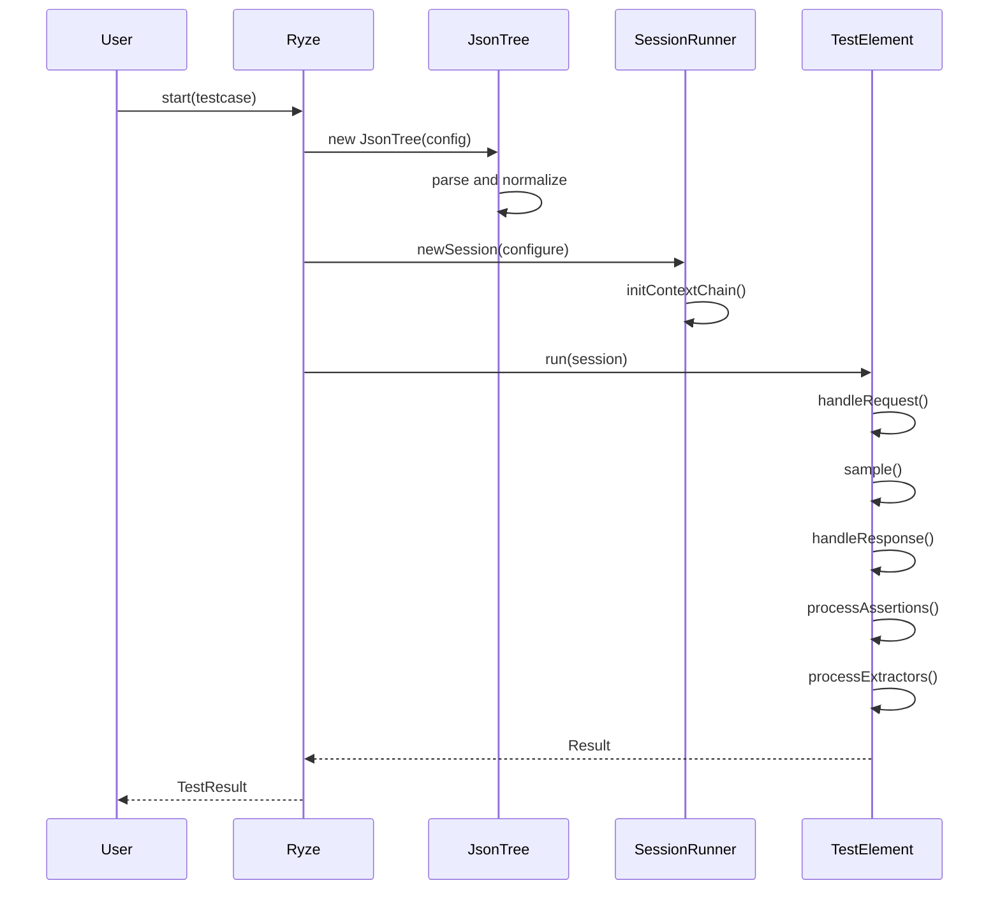

# 🏗️ Ryze 架构设计文档

## 📖 概述

Ryze 是一个基于 Java 21 的现代化多协议测试框架，采用模块化架构设计，通过 SPI (Service Provider Interface) 机制实现了高度的可扩展性。本文档详细描述了框架的整体架构、核心组件、设计模式以及扩展机制。

## 🎯 设计目标

### 核心设计原则

1. **模块化**: 各协议模块独立，便于维护和扩展
2. **可扩展性**: 基于 SPI 机制，支持自定义组件
3. **代码与配置分离**: 测试逻辑与数据分离，提升可维护性
4. **统一接口**: 所有协议共享相同的测试组件接口
5. **高性能**: 优化的执行引擎和资源管理

### 技术选型考虑

- **Java 21**: 利用最新 JVM 特性和性能优化
- **FastJSON2**: 高性能 JSON 处理
- **FreeMarker**: 强大的模板引擎支持
- **SPI 机制**: 标准化的扩展接口
- **无依赖冲突**: 精心选择的依赖库版本

## 🏗️ 整体架构

### 架构层次图



### 模块依赖关系



## 🔧 核心组件

### 1. ApplicationConfig - 配置管理器

```java
public class ApplicationConfig {
    // 通过 SPI 机制动态加载各种组件映射
    private static Map<String, Class<? extends TestElement>> TEST_ELEMENT_KEY_MAP;
    private static Map<String, Class<? extends Assertion>> ASSERTION_KEY_MAP;
    // ... 其他组件映射
}
```

**职责**:

- 管理所有测试组件的类型映射
- 通过 SPI 机制动态加载扩展组件
- 提供线程安全的组件访问
- 实现懒加载和缓存机制

**设计模式**: 单例模式 + 延迟加载

### 2. SessionRunner - 执行引擎

```java
public class SessionRunner {
    private final SessionContext sessionContext;
    private final Configure configure;
    private List<Context> contextChain;
    private ContextWrapper context;
}
```

**职责**:

- 管理测试执行的生命周期
- 维护测试上下文链
- 协调各组件的执行
- 提供变量存储和共享机制

**设计模式**: 命令模式 + 责任链模式

### 3. JsonTree - 配置解析器

```java
public class JsonTree extends JSONObject {
    // 将原始 JSON 转换为标准化的测试配置
    public JsonTree(JSONObject testcase) {
        replaceExpiredKeys(testcase);
        var json = prepare(testcase);
        initialize(json, isRyzeTestFramework(json));
    }
}
```

**职责**:

- 解析和标准化 JSON/YAML 测试配置
- 处理键名大小写转换
- 支持配置继承和合并
- 递归处理嵌套结构

**设计模式**: 建造者模式 + 递归模式

### 4. TestElement - 测试元件基类

```java
public interface TestElement<T extends Result> extends Validatable, Cloneable<TestElement<T>> {
    default T run(SessionRunner session) {
        return null;
    }
    
    default TestElement<T> copy() {
        return this;
    }
}
```

**设计特点**:

- 所有测试组件的基础接口
- 支持配置验证和对象克隆
- 非线程安全，需要复制后使用
- 支持配置继承和上下文传递

## 🎨 设计模式应用

### 1. 策略模式 (Strategy Pattern)

**应用场景**: 不同协议的 Sampler、Processor 实现

```java
// 统一接口
public interface Sampler<T extends Result> extends TestElement<T> {}

// 具体策略实现
@KW("http")
public class HTTPSampler implements Sampler<DefaultSampleResult> {}

@KW("dubbo")
public class DubboSampler implements Sampler<DefaultSampleResult> {}
```

**优势**:

- 运行时动态选择协议实现
- 新增协议无需修改核心代码
- 每个协议独立维护和测试

### 2. 建造者模式 (Builder Pattern)

**应用场景**: 测试组件的构建和配置

```java
public class HTTPSampler {
    public static class Builder extends AbstractSampler.Builder<...> {
        public Builder method(String method) { ... }
        public Builder url(String url) { ... }
        public Builder header(String name, String value) { ... }
        public HTTPSampler build() { ... }
    }
}
```

**优势**:

- 支持链式调用，API 友好
- 参数验证和默认值设置
- 复杂对象的分步构建

### 3. 模板方法模式 (Template Method Pattern)

**应用场景**: 测试组件的执行流程

```java
public abstract class AbstractSampler<SELF, CONFIG, RESULT> {
    public final RESULT run(SessionRunner session) {
        // 1. 准备阶段
        handleRequest(context, result);
        // 2. 执行阶段
        sample(context, result);
        // 3. 处理阶段
        handleResponse(context, result);
        // 4. 后处理阶段
        return result;
    }
    
    protected abstract void sample(ContextWrapper context, RESULT result);
}
```

**优势**:

- 统一的执行流程和生命周期
- 子类只需实现特定步骤
- 便于添加通用功能和拦截器

### 4. 工厂模式 (Factory Pattern)

**应用场景**: 根据配置创建测试组件

```java
public class ComponentFactory {
    public static TestElement create(String type, JSONObject config) {
        Class<?> clazz = ApplicationConfig.getTestElementKeyMap().get(type);
        return (TestElement) JSON.to(clazz, config);
    }
}
```

**优势**:

- 隐藏对象创建复杂性
- 支持基于配置的动态创建
- 便于扩展新的组件类型

### 5. 责任链模式 (Chain of Responsibility Pattern)

**应用场景**: 上下文管理和变量解析

```java
public class ContextWrapper {
    private List<Context> contextChain;
    
    public Object getVariable(String name) {
        for (Context context : contextChain) {
            Object value = context.getVariable(name);
            if (value != null) return value;
        }
        return null;
    }
}
```

**优势**:

- 支持多层级的变量继承
- 灵活的上下文管理
- 便于扩展新的上下文类型

### 6. 观察者模式 (Observer Pattern)

**应用场景**: 测试报告和事件监听

```java
public interface ReporterListener extends RyzeInterceptor {
    void beforeTest(TestElement element);
    void afterTest(TestElement element, Result result);
}

// Allure 集成
public class AllureReportListener implements ReporterListener {
    // 监听测试事件，生成 Allure 报告
}
```

**优势**:

- 松耦合的事件通知机制
- 支持多种报告格式
- 便于集成第三方工具

## 🔌 扩展机制

### SPI 服务发现

Ryze 使用 Java SPI 机制实现组件的自动发现和注册：

```text

META-INF/services/
├── io.github.xiaomisum.ryze.core.testelement.TestElement
├── io.github.xiaomisum.ryze.core.assertion.Rule
├── io.github.xiaomisum.ryze.core.extractor.Extractor
└── io.github.xiaomisum.ryze.core.testelement.processor.Preprocessor
```

### 自定义组件开发

1. **实现相应接口**:

```java
@KW("custom_sampler")
public class CustomSampler implements Sampler<DefaultSampleResult> {
    @Override
    public DefaultSampleResult run(SessionRunner session) {
        // 自定义实现逻辑
    }
}
```

2. **注册 SPI 服务**:

```java
# META-INF/services/io.github.xiaomisum.ryze.core.testelement.TestElement
com.example.CustomSampler
```

3. **在测试配置中使用**:

```json
{
  "testclass": "custom_sampler",
  "customParam": "value"
}
```

### 协议模块开发指南

开发新的协议模块需要实现以下组件：

1. **Sampler 取样器**
2. **Preprocessor 前置处理器**
3. **Postprocessor 后置处理器**
4. **ConfigureItem 配置项**
5. **Builder 构建器集合**

参考现有协议模块的实现结构。

## 🏃 执行流程

### 测试执行生命周期



### 变量解析流程

```mermaid
graph TD
    A[模板字符串 "${varName}"] --> B[FreeMarker 模板引擎]
    B --> C[上下文链查找变量]
    C --> D{变量存在?}
    D -->|是| E[替换变量值]
    D -->|否| F[函数调用?]
    F -->|是| G[执行函数]
    F -->|否| H[保持原样]
    E --> I[返回处理后字符串]
    G --> I
    H --> I
```

## 📊 性能优化

### 1. 组件缓存

```java
public class ApplicationConfig {
    // 使用 ReadWriteLock 保证线程安全的缓存
    private static final ReadWriteLock CACHE_LOCK = new ReentrantReadWriteLock();
    private static Map<String, Class<?>> COMPONENT_CACHE;
}
```

### 2. 对象复用

```java
public interface Cloneable<T> {
    T copy(); // 基于 Kryo 的高效对象复制
}
```

### 3. 懒加载

```java
private static <T> T getDataMap(ReadWriteLock lock, Supplier<T> getter, Supplier<T> loader) {
    // 双重检查锁定模式
}
```

### 4. 内存管理

- 使用 ThreadLocal 管理会话状态
- 及时清理测试上下文
- 合理的对象生命周期管理

## 🔒 线程安全

### 设计原则

1. **会话隔离**: 每个线程使用独立的 SessionRunner
2. **无状态组件**: 核心组件不保存可变状态
3. **对象复制**: TestElement 需要复制后使用
4. **读写锁**: 保护共享缓存的访问

### 并发支持

```java
public class SessionRunner {
    public static final ThreadLocal<SessionRunner> HOLDER = new ThreadLocal<>();
    
    public static SessionRunner getSessionIfNoneCreateNew() {
        var session = HOLDER.get();
        if (session == null) {
            session = new SessionRunner(Configure.defaultConfigure());
            HOLDER.set(session);
        }
        return session;
    }
}
```

## 🚀 未来架构演进

### 计划中的改进

1. **反应式编程支持**: 集成 Reactor 或 RxJava
2. **云原生支持**: Kubernetes 部署和扩展
3. **分布式测试**: 支持集群模式测试执行
4. **流处理协议**: 支持 WebSocket、GRPC Stream
5. **AI 辅助测试**: 智能测试生成和分析

### 架构演进原则

- 保持向后兼容性
- 渐进式改进，避免大爆炸式重构
- 社区驱动的功能开发
- 性能和稳定性优先

---

本架构文档将随着框架的发展而持续更新。如有建议或问题，欢迎在 [Issues](https://github.com/XiaoMiSum/ryze/issues) 中讨论。
