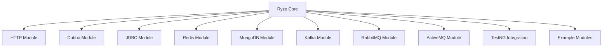

# 介绍

Ryze 是一个基于 Java 21 开发的现代化测试框架，专为多协议测试而设计。它通过 JSON/YAML
描述测试场景，实现了测试用例与代码的完全分离，提供了统一的测试执行方式和丰富的扩展能力。

## 核心特性

### 🎯 测试用例与代码分离

采用 JSON/YAML 描述测试场景，保障测试用例的统一性和可维护性。

### 🔧 多协议支持

原生支持 HTTP(S)、Dubbo、JDBC、Redis、MongoDB、Kafka、RabbitMQ 等协议。

### ⚡ 丰富的测试组件

内置前置/后置处理器、断言验证器、数据提取器等，轻松实现复杂测试场景。

### 🎨 灵活的校验机制

支持多种断言规则，包括相等性、包含性、正则匹配等验证方式。

### 🚀 极强的可扩展性

基于 SPI 机制，支持自定义协议、处理器、断言规则等组件。

### 📊 美观的测试报告

集成 Allure，生成详细的测试报告。

## 系统架构

Ryze 采用模块化架构设计，核心模块提供基础能力，协议模块提供扩展能力：

## 核心组件

- **测试元件 (TestElement)**: 所有测试组件的基类，支持配置继承和上下文管理
- **取样器 (Sampler)**: 执行具体的测试操作，如发送 HTTP 请求、调用 Dubbo 服务
- **处理器 (Processor)**: 在测试执行前后处理数据，支持前置和后置处理
- **断言器 (Assertion)**: 验证测试结果是否符合预期
- **提取器 (Extractor)**: 从测试结果中提取数据供后续使用

